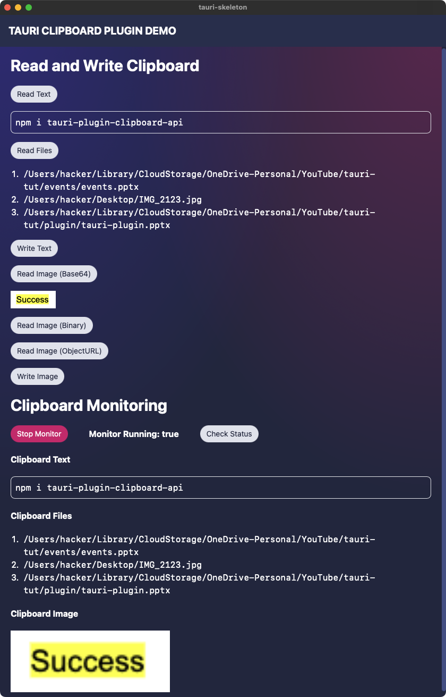

# Tauri Plugin clipboard

> A Tauri plugin for clipboard read/write/monitor. Support text, files and image.
>
> The reason I built this plugin is becasue official Tauri API only supports clipboard with text, not image or files. So you can still use the official API for text.

## Installation

> If you are installing from npm and crate.io package registry, make sure the versions for both packages are the same, otherwise, the API may not match.

Crate: https://crates.io/crates/tauri-plugin-clipboard

`cargo add tauri-plugin-clipboard` to add the package.

Or add the following to your `Cargo.toml` for the latest unpublished version (not recommanded).

```toml
tauri-plugin-clipboard = { git = "https://github.com/CrossCopy/tauri-plugin-clipboard" }
```

You can also add a tag to github url.

```toml
tauri-plugin-clipboard = { git = "https://github.com/CrossCopy/tauri-plugin-clipboard", tag = "v0.5.0" }
```

NPM Package: https://www.npmjs.com/package/tauri-plugin-clipboard-api

Run the following to install JavaScript/TypeScript API package.

```bash
npm i tauri-plugin-clipboard-api
# npm add https://github.com/CrossCopy/tauri-plugin-clipboard # or this for latest unpublished version (not recommended)
```

In `main.rs`, add the following to your `tauri::Builder`:

```rust
tauri::Builder::default()
    .plugin(tauri_plugin_clipboard::init())
    .run(tauri::generate_context!())
    .expect("failed to run app");
```

Read more in the [official doc](https://tauri.app/v1/guides/features/plugin/#using-a-plugin) about how to use.

## Example

> The best way to learn this plugin is to read the source code of the example.
>
> The example is very detailed.



```bash
npm run build
cd examples/demo
npm i
npm run tauri dev
# there are a few buttons you can click to test the clipboard plugin
```

See [+page.svelte](examples/demo/src/routes/+page.svelte) for an example of how to use the plugin in JS/TS.

It works the same with other frontend frameworks like Vue, React, etc.

## Sample Usage (TypeScript API)

```ts
import {
  readText,
  readFiles,
  writeText,
  readImage,
  readImageBinary,
  readImageObjectURL,
  writeImage,
  clear
} from "tauri-plugin-clipboard-api";

await readText();
await writeText("huakun zui shuai");

readImage()
  .then((base64Img) => {
    imageStr = `data:image/png;base64, ${base64Img}`;
  })
  .catch((err) => {
    alert(err);
  });

await writeImage(sample_base64_image);
const files: string[] = await readFiles();
```

### Sample Usage (Rust API)

`ClipboardManager` contains the state state as well as the API functions.

```rust
use tauri::Manager;
use tauri_plugin_clipboard::ManagerExt;

fn main() {
  tauri::Builder::default()
    .plugin(tauri_plugin_clipboard::init())
    .setup(|app| {
        let handle = app.handle();
        let clipboard = handle.state::<tauri_plugin_clipboard::ClipboardManager>();
        clipboard.write_text("huakun zui shuai".to_string()).unwrap();
        Ok(())
    })
    .build(tauri::generate_context!())
    .expect("failed to run app");
}
```

### Sample Listener Usage

We use Tauri's event system. Start a listener with Tauri's `listen()` function to start listening for event, and call `listenImage()` and `listenText()` to listen for clipboard update. When clipboard is updated, event will be emitted.

The following example is in svelte.

```ts
import type { UnlistenFn } from "@tauri-apps/api/event";
import { onDestroy, onMount } from "svelte";
import {
  onClipboardUpdate,
  onImageUpdate,
  onTextUpdate,
  onFilesUpdate,
  startListening,
  listenToMonitorStatusUpdate,
  isMonitorRunning,
} from "tauri-plugin-clipboard-api";

let text = "";
let files: string[] = [];
let base64Image = "";
let monitorRunning = false;
let unlistenTextUpdate: UnlistenFn;
let unlistenImageUpdate: UnlistenFn;
let unlistenClipboard: () => Promise<void>;
let unlistenFiles: UnlistenFn;
onMount(async () => {
  unlistenTextUpdate = await onTextUpdate((newText) => {
    text = newText;
  });
  unlistenImageUpdate = await onImageUpdate((b64Str) => {
    base64Image = b64Str;
  });
  unlistenFiles = await onFilesUpdate((newFiles) => {
    files = newFiles;
  });
  unlistenClipboard = await startListening();

  onClipboardUpdate(() => {
    console.log("plugin:clipboard://clipboard-monitor/update event received");
  });
});

listenToMonitorStatusUpdate((running) => {
  monitorRunning = running;
});

onDestroy(() => {
  unlistenTextUpdate();
  unlistenImageUpdate();
  unlistenClipboard();
  unlistenFiles();
});
```

## Notes

> You don't really need to read this section if you are just using the plugin.

The logic of tauri's listen API is encapsulated in `onTextUpdate`, `onFilesUpdate`, `startListening`.

You can also listen to the events directly using Tauri's `listen()` function.

```ts
import {
  TEXT_CHANGED,
  FILES_CHANGED,
  IMAGE_CHANGED,
} from "tauri-plugin-clipboard-api";

await listen(TEXT_CHANGED, (event) => {
  const text = event.payload.value;
});
```

The listener `startListening` function contains two parts:

1. Start monitor thread in Tauri core (rust). (Invoke `start_monitor` command)
2. Run `listenToClipboard` function.
   1. The rust code only emit event (`plugin:clipboard://clipboard-monitor/update`) when clipboard is updated without the clipboard content because we don't always need the content.
   2. In order to distinguish content type, `listenToClipboard` detects the data type and emit new events.`onTextUpdate`, `onFilesUpdate`, `startListening` listen to these events.
      1. `plugin:clipboard://text-changed`
      2. `plugin:clipboard://files-changed`
      3. `plugin:clipboard://image-changed`

The returned unlisten function from `startListening` also does two things:

1. Stop monitor thread by invoking `stop_monitor` command.
2. Stop listener started in `listenToClipboard`.

The base64 image string can be converted to `Uint8Array` and written to file system using tauri's fs API.

```ts
import { writeBinaryFile, BaseDirectory } from "@tauri-apps/api/fs";

writeBinaryFile(
  "tmp/avatar.png",
  new Uint8Array(
    atob(base64Img)
      .split("")
      .map((char) => char.charCodeAt(0))
  ),
  { dir: BaseDirectory.Cache }
);
```
